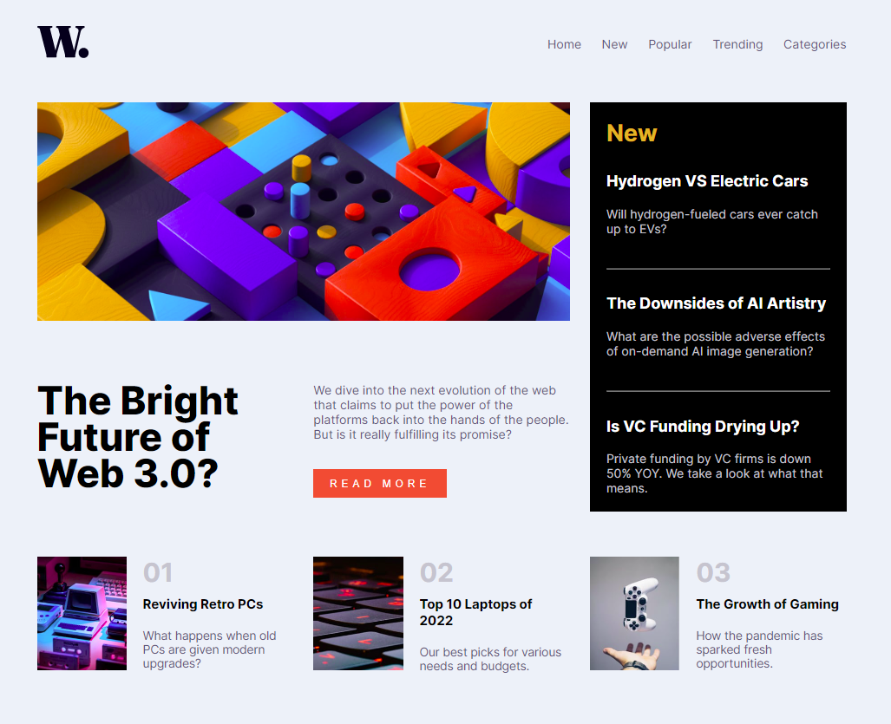

# Frontend Mentor - News homepage solution

This is a solution to the [News homepage challenge on Frontend Mentor](https://www.frontendmentor.io/challenges/news-homepage-H6SWTa1MFl).

## Table of contents

- [Overview](#overview)
  - [The challenge](#the-challenge)
  - [Screenshot](#screenshot)
  - [Links](#links)
- [My process](#my-process)
  - [Built with](#built-with)
  - [What I learned](#what-i-learned)
  - [Continued development](#continued-development)
  - [Useful resources](#useful-resources)
- [Author](#author)

## Overview

### The challenge

Users should be able to:

- View the optimal layout for the interface depending on their device's screen size
- See hover and focus states for all interactive elements on the page
- **Bonus**: Toggle the mobile menu (requires some JavaScript)

### Screenshot

### Links

- Solution URL: [click here](https://github.com/climaco-sarmiento/news-homepage-challenge)
- Live Site URL: [click here](https://climaco-sarmiento.github.io/news-homepage-challenge/)

## My process

### Built with

- Semantic HTML5 markup (I'm not focusing on clean code yet)
- CSS custom properties
- Flexbox
- CSS Grid
- Mobile-first workflow

### What I learned

Initially I tried to solve it with flexbox only. But I soon realized the limitations and learned and implemented Grid. This is my first ever implimentation, although fairly simple.

### Continued development

I have repurposed JavaScript code from W3S. Although I am at 5KYU (JS) at codewars, I still need to learn DOM manipulation. Something I will be focusing in the near future as I will be doing more of these challenges.

### Useful resources

- [How TO - Curtain Menu](https://www.w3schools.com/howto/howto_js_curtain_menu.asp) - A super helpful resource that I used for the mobile menu.

## Author

- Website - [Ubaid Khalid](https://www.ubaidkhalid.dev)
- LinkedIn - [Ubaid Khalid](https://www.linkedin.com/in/ubaid-khalid-dev/)
